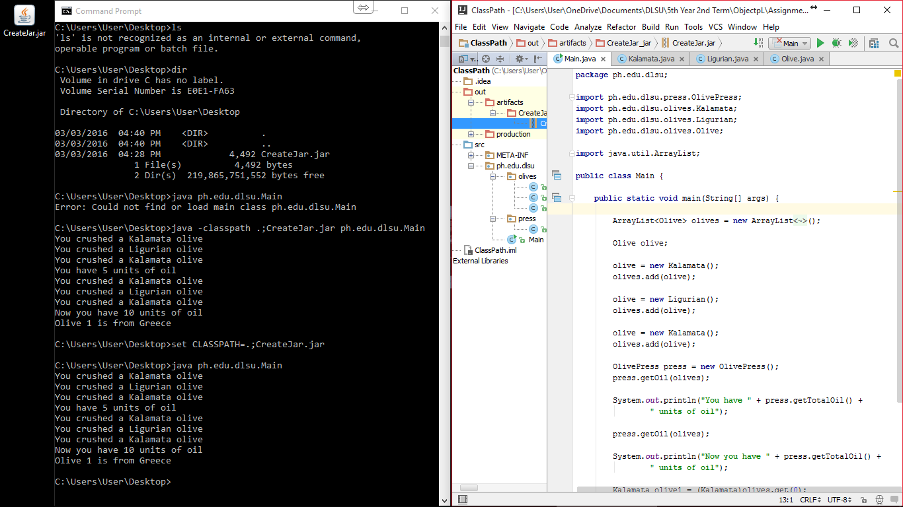

#ClassPath

Trying to run the jar file using a terminal or command prompt.

#ScreenShot

#Code

*Code will depend on the project you are trying to place in a jar file.*

#Process

*See the screenshot and follow the commands used in the command prompt.*
